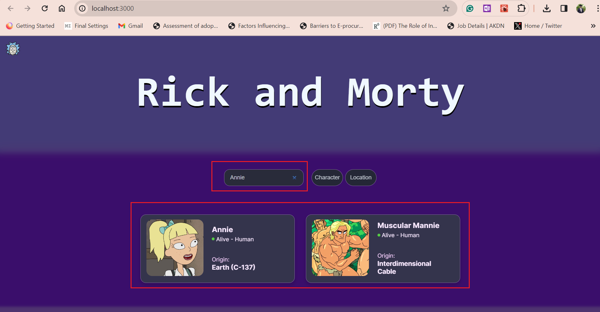

## APPLICATION with Rick and Morty API info cards by ALLAN ROP
Application Developed Using javascript was made with the Rick and Morty API (https://rickandmortyapi.com/)

And you can also change between characters or locations:


## Getting Started
clone the repository
https://github.com/Allan-Rop/Rick-and-Morty-Test
```
git clone https://github.com/Allan-Rop/Rick-and-Morty-Test.git

```

npm install to install dependenies then by;<br>
1. Navigating to the current root directory of your project then;
```
npm install
```
to install dependencies
## serve  the Application
```bash
npm run dev
# or
yarn dev
# or
pnpm dev
# or
bun dev
```

Open [http://localhost:3000](http://localhost:3000) with your browser to see the result.

RESULTS


# Features
1.Retrieve a list of locations along with their residents and status.<br>

2.Search or filter locations by location name, character name.<br>

3.View detailed information about each resident, including their name, status, and image.<br>

4.Add persisted notes about a character on their details screen.

5. On the Location page see screenshots below;

6. Fetching Comments and storing them to mysql database including character details.
   #### To Note
   Remember to change your username and password for your database connection 


## Challenging Points Encountered
Database Integration: Integrating MySQL with Next.js posed a challenge initially due to asynchronous nature of database queries and rendering. I solved this by using asynchronous functions and ensuring proper error handling to manage database operations effectively.

Search and Filtering: Implementing search and filter functionality efficiently was another challenge. I tackled this by optimizing database queries and utilizing client-side filtering techniques to enhance performance and user experience.

Image Rendering: Rendering images of residents alongside their details required careful handling, especially with dynamic data. I resolved this by ensuring proper image storage and retrieval mechanisms, along with appropriate error handling to handle missing or invalid images gracefully.

Persisted Notes: Implementing persisted notes functionality involved managing state across multiple components and ensuring data consistency. I addressed this challenge by using state management libraries like Redux and implementing robust data storage and retrieval mechanisms.

## Regards
Allan Rop
Rick and Morty API's